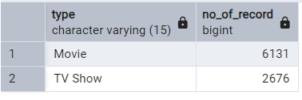
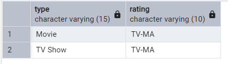
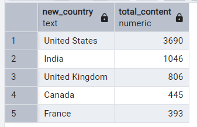

# Netflix Data Analysis Project

## Overview
This project analyzes a Netflix dataset using SQL to derive business insights. The dataset includes information about TV shows and movies available on Netflix, such as title, director, cast, country, date added, release year, rating, and more.

## Dataset Information
The dataset contains the following columns:
- **show_id**: Unique identifier for each show.
- **type**: Indicates whether it is a Movie or TV Show.
- **title**: Name of the show.
- **director**: Name of the director.
- **casts**: List of actors.
- **country**: Country of production.
- **date_added**: Date when the show was added to Netflix.
- **release_year**: Year of release.
- **rating**: Content rating (e.g., PG, R, TV-MA).
- **duration**: Duration of the show.
- **listed_in**: Genre category.
- **description**: Short description of the show.

## SQL Analysis Performed
The project includes SQL queries to answer key business questions, such as:
1. Counting the number of Movies vs TV Shows.
   
2. Finding the most common rating for Movies and TV Shows.
   
3. Listing all movies released in a specific year.
   [Download CSV](data/Soln3.csv)
4. Identifying the top 5 countries with the most content.
   
5. Finding the longest movie.
   [Download CSV](data/Soln5.csv)
6. Analyzing content added in the last 5 years.
   [Download CSV](data/Soln6.csv)
7. Finding all the movies/TV shows by a specific director.
   [Download CSV](data/Soln7.csv)
8. Listing all TV shows with more than 5 seasons.
   [Download CSV](data/Soln8.csv)
9. Counting the number of content items in each genre.
   [Download CSV](data/Soln9.csv)
10. Finding the top 5 years with the highest average content releases in India.
    [Download CSV](data/Soln10.csv)
11. Listing all movies that are documentaries.
    [Download CSV](data/Soln11.csv)
12. Identifying content without a director.
    [Download CSV](data/Soln12.csv)
13. Finding how many movies actor 'Salman Khan' appeared in over the last 10 years.
    [Download CSV](data/Soln13.csv)
14. Identifying the top 10 actors appearing in the most Indian movies.
    [Download CSV](data/Soln14.csv)
15. Categorizing content based on the presence of keywords like 'kill' and 'violence' in descriptions.
    [Download CSV](data/Soln15.csv)

## How to Use
1. Import the dataset into a SQL database.
2. Run the SQL scripts (`Netflix.sql` and `Business Problems Netflix.sql`) to create and modify tables.
3. Execute the provided queries to analyze the dataset.

## Requirements
- Any SQL-supported database (e.g., MySQL, PostgreSQL, SQLite).
- Basic knowledge of SQL queries.

## Contributing
Feel free to contribute by improving queries, adding new insights, or optimizing performance. Submit a pull request with your changes.

## License
This project is open-source under the MIT License.

